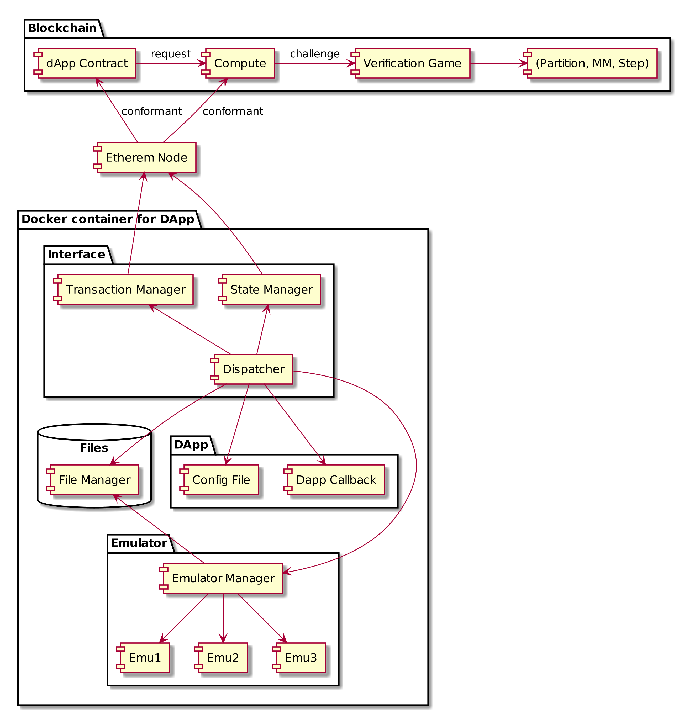
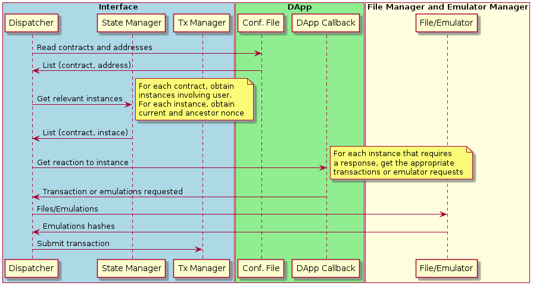

# Infrastructure

This provides the infrastructure to support the development of dApps, improving transaction and event management

## Goals

- safety: power failure, attacks, lost transactions...
- easy dapp development: no worries about blockchain idiosyncrasies, no concerns with various instances running in parallel, no async programming, no worries about branching histories in the main chain.

To achieve these goes we will: minimize state, take care of the unavoidable state on behalf of the dApp developer.

This also requires a modular architecture, as we can encapsulate the state in a single module, and approach a functional design.
Modularity is also beneficial for us as it allows for independent development through a well defined interfaces and easier tests.

Concerning the state, we have the following preferences (in decreasing order):

- no state
- cache-only state (can be reconstructed from other states)
- append only state (no need version control)

Moreover, when we have an unavoidable state, we should keep it encapsulated in a single component that "owns that state".

What is strictly necessary for Cartesi to work is:

- The state present in the blockchain (we may cache some of it).
- The transaction pool (annoying bit).
Only one module should know of its existence.
- A collection of files with their hashes.
In a first moment, this collection could be "append only", meaning that one can only add files to the collection, retrieve them and garbage collect them when they are *provably* unnecessary.
Files need strong backup systems.

Every other state in the system should be able to bootstrap from the above ones.

## Overall Structure

So, the purpose of each of these components is described briefly. Later we will give an overview of the Dispatcher Loop, than a detailed description of each of the interfaces between these components.

### Dispatcher

This is a component that we offer to loop while observing the state of the blockchain and acting on the behalf of the dApp.
This component is very central in the sense that it communicates to all others in the system.
This apparent complexity is mitigated by the fact that it contains no state and can always gracefully recover from a power-down.

### Transaction Manager

Whenever the dApp needs to send a transaction to the blockchain, it has the possibility to do it through our Transaction Manager, which will take care of all the bureaucracy from both the Ethereum Blochchain and the Transaction Pool.

### State Manager

DApps written for Cartesi will work best if their smart contracts have some "getter functions" that are predefined by us, guiding somehow the inner workings of the contract.
Since these getter functions are standard, we have a component dedicated to read these data, which abstracts away:

- the specific blockchain that we are dealing with,
- whether we work with a full or light node

### DApp Callback

This is where the dApp-specific action takes place.
In order to make a Cartesi dApp, a developer has to implement three things: a few smart contracts, some machines to run in our emulator and the "DApp Callback".

This module is called by the Dispatcher, with all the state information that it needs in order to make decisions, then it can access files on the File Manager and return some action to the Dispatcher in the form of transactions.

### Configuration File

This is a simple file holding data that is specific of the user's installation of the dApp, like the user's address.

### File manager

Cartesi offers the possibility to deal with large amounts of data on the blockchain.
This will only be possible because we can store large files off-chain, while refering to them on-chain through their Merkle-tree hashes.
The File Manager service will keep files on behalf of the dApp, reducing the state of the DApp Callback.
This manager can provide several aditional services in the future, such as backups, p2p sharing, making data available and collecting signatures, etc.

### Ethereum Node

This is self explanatory. Async, complex, but self explanatory.

## The Dispatcher Loop

The Dispatcher should be stateless, so that in the event of a power-down, it can recover seamlessly.
Imagining that the Dispatcher just woke up, it will perform the following steps in order:

1. Open the Configuration File to collect data which is specific to this user.
The main content of this file is the list of concerns as explained below.
1. Contact the State Manager to obtain all the blockchain information that is relevant to the user. Examples: in contract partition, instance 17, the state is WaitingQuery.
1. Ask the Transaction Manager which of these instances is being treated now and which needs a reaction from this node.
1. All this information is passed to the DApp Callback, which will have to take a decision on how to proceed (more details later). The DApp Callback returns to the Dispatcher one (or more) transactions that should be sent to the blockchain.
1. The Dispatcher sends these transactions to the Transaction Manager that will make sure they are inserted into the blockchain.

## Configuration File

The configuration file uses the `yaml` language to store its data.
The most important element in this file is called `concerns` and it is a list of things that the dApp cares about.
Each element of the `concerns` list is a dictionary describing the various parameters of this concern.

An example of such file would be the following:

    # This is a config file for a dApp
    # starting with the list of concerns
    concerns:
      -
        contract: 0xf778b86fa74e846c4f0a1fbd1335fe81c00a0c91
        address: 0x6ac7ea33f8831ea9dcc53393aaa88b25a785dbf0
      -
        contract: 0xfffd933a0bc612844eaf0c6fe3e5b8e9b6c1d19c
        address: 0x6ac7ea33f8831ea9dcc53393aaa88b25a785dbf0

## Conformant Contracts

Each contract that wants to enjoy of Cartesi's architecture and infrastructure must be organized in a certain fashion to facilitate interactions with it.

`instances` The first aspect in this specification is to be organized around instances.
Each conformant smart contract needs to contain an array of instances, each of which contains a struct describing that whole instance.
For example, in the partition smart contract, there is an array of instances, each of these instances represents a dispute between two players to find the point they disagree with.

`uint currentInstance()` This returns the number of the last used instance plus one and coincides with the number of instances initialized.

`bool isActive(uint instance)` These contracts should also implement a pure function, answering whether a given instance is still active or not.
This helps trim out the instances that need no more attention.

`bool isConcerned(uint instance, address player)` There should be a pure function to determine if a certain player should be concerned with a certain instance.

`uint getNonce(uint instance)` Each instance should have a nonce that is incremented when transactions are not reversed.
This nonce is important in various moments for the off-chain component to decide on how to react.

`bytes getState(uint instance)` This pure function returns the current state of one particular instance.
Note that all data which is necessary for players to react to this instance should be available in the return of this function, although not necessarily the full state of the contract.
For example, in the case of partition, one possible return for this function would contain something like `[nonce: 5, state: 2, queryArray: [0, 200, 400, 600]]` encoded appropriately.

## State Manager

The responsibilities of the State Manager are:

- query conformant contracts to find instances that are concerning to our users.
These queries should also include the `nonce` and the `user_nonce`, which is the last nonce in which the address has acted.
- cache this information for faster retrieval
- get the current state of the contract
- do all of the above work efficiently with both a full or a light Ethereum node.

Its state can be fully bootstrapped from the information present in the blokchain, but caching is essential to get any acceptable performance.

#### Calls

The first query that the SM accepts asks for a certain pair (contract, address)

    { contract: 0xf778b86fa74e846c4f0a1fbd1335fe81c00a0c91,
      address: 0x6ac7ea33f8831ea9dcc53393aaa88b25a785dbf0
    }

It should receive a list of active and concerning instances:

    [{ instance: 23, nonce: 22, user_nonce: 21 }
     { instance: 218, nonce: 1, user_nonce: 1 }]

The second type of queries that the SM receives concerns the state of a given instance:

    { contract: 0xf778b86fa74e846c4f0a1fbd1335fe81c00a0c91,
      instance: 23
    }

The response of this query gives simply the result the `getState` call:

    { nonce: 22,
      state: 2,
      queryArray: [0, 200, 400, 600]
    }

where the above is encoded into a binary according to the Ethereum ABI.

#### State

The State Manager is capable of bootstrapping from zero in case of disk failure, so there is no need for a strong backup of its permanent data.

However, it is important for the State Manager to cache some information in order to avoid the long process of querying all data to the blockchain in each time.

This permanent data is a key-value table, where each key is of the form `(contract, address)` (perhaps using CSV or c14n):

    { contract: 0xf778b86fa74e846c4f0a1fbd1335fe81c00a0c91,
      address: 0x6ac7ea33f8831ea9dcc53393aaa88b25a785dbf0
    }

And for each such key, it should be stored:

    { last_current_instance: 344,
      last_block: 54320939,
      active_instances: [
        { instance: 23, last_nonce: 22, last_user_nonce: 21 },
        { instance: 218, last_nonce: 1, last_user_nonce: 1 }
      ]
    }

where `last_instance` corresponds to the last value that was recorded for the function `currentInstance()`.
If this value is not up to date, we have to read the new instances that have appeared and update our database accordingly.

If on the other hand we are aware of a certain instance that is concerned by our address (say `23`), then knowing the last known nonce helps us knowing if we need any work to update the value of the user nonce.

It may be important for the dApp to know both the `nonce` and the `user_nonce` because of issues with the transaction pool.

#### First implementation

A first implementation of the State Manager can leave aside the `user_nonce`, which is slightly annoying to recover.
In this case, the permanent storage can hold simply:

    { last_current_instance: 344,
      active_instances: [
        { instance: 23 },
        { instance: 218 }
      ]
    }

And retrieve the rest from the blockchain when necessary.

## Transaction Manager

The roles of the Transaction Manager are:

- sign and send transactions to the main chain when requested
- make sure the current transactions make through, by possibly increasing the fees until a pre-established limit.
- answer if a certain transaction is being taken care of.

#### State

bootstrap

#### Calls

user nonce is read once and glued in the transaction until further notice.
